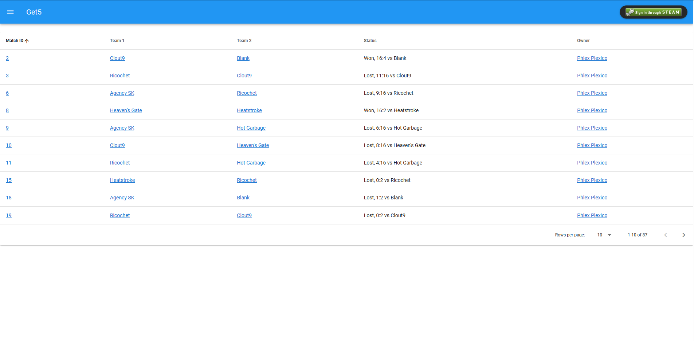
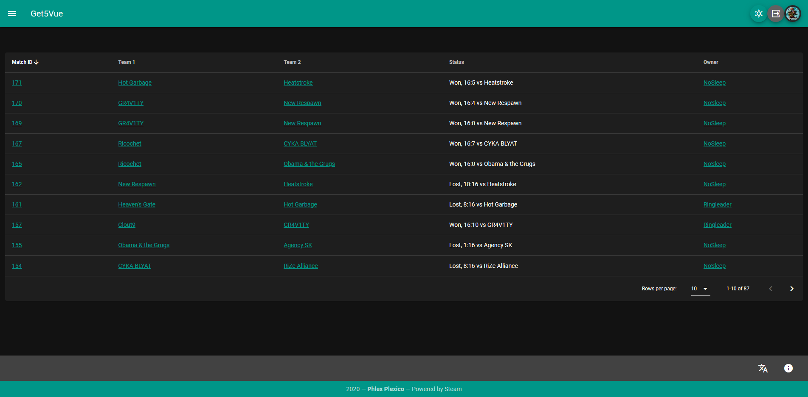
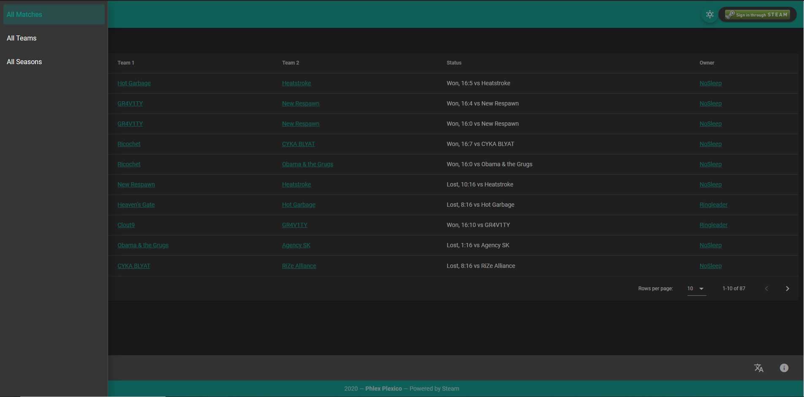
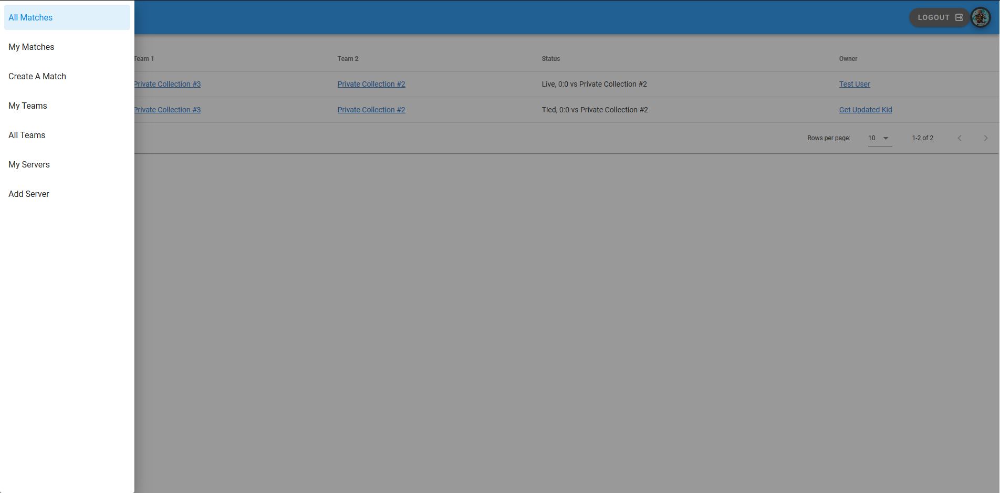
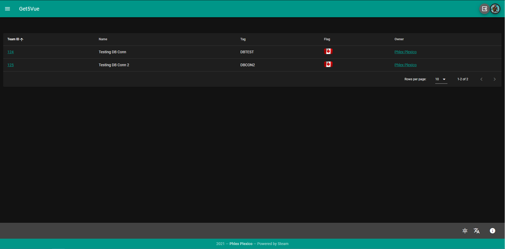
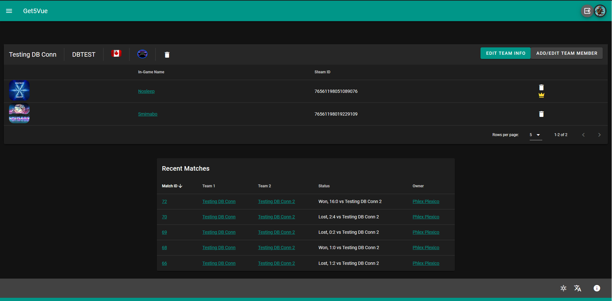
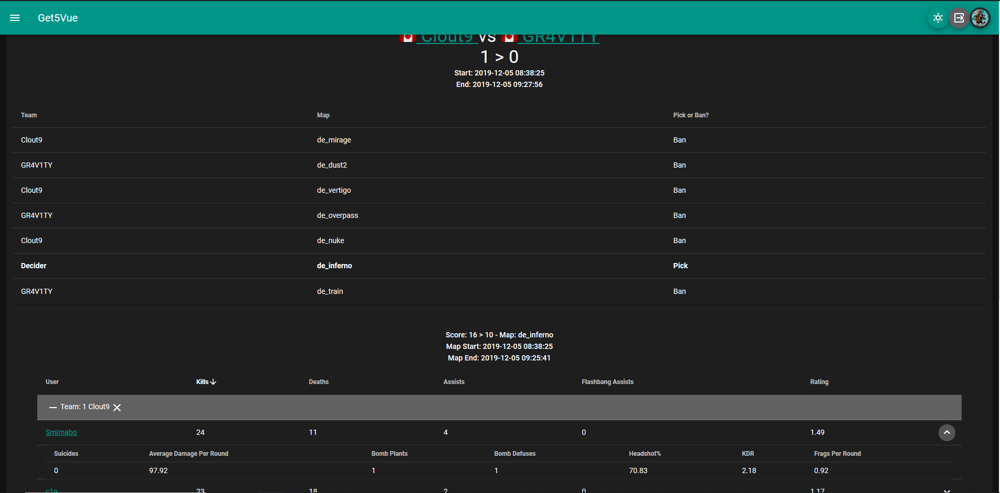
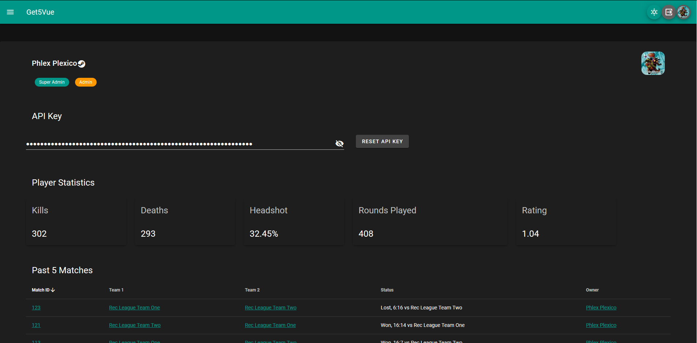
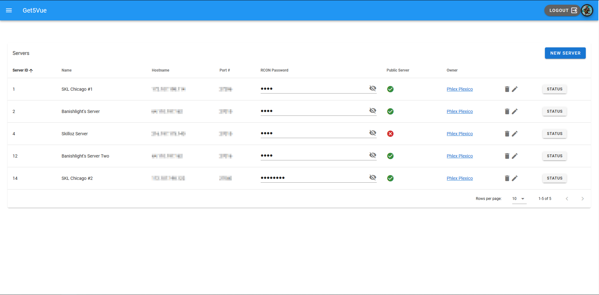

# Get5Vue - Front-end website for G5API
_**Status: Beta. Under active development.**_

Get5Vue (G5V) is going to be a replacement for the get5-webpanel. _Currently_ this is a basic implementation for the extent of [G5API](https://github.com/phlexplexico/G5API) and is going to focus on basic features of presenting data.


## Features
- Add teams
- Add seasons/tournaments to track specific stats.
- Add servers to play on.
- Create matches that load on selected servers.
- Control matches with RCON Commands through the match panel.
- Dark mode!
- Translations!

## What does it NOT do?
One of the features currently missing is the ability to see leaderboards and statistics over time. You can look at individual match scores and see the way the match played out. Please note that the API and the panel may still be buggy. Please report any *match* issues to the [API](https://github.com/phlexplexico/G5API). Display issues, please report them here.

## Why?
[Get5-webpanel](https://github.com/phlexplexico/get5-webpanel) is a now out-dated webpanel, with python2.7 being officially EOL. Being built all on Flask, with ORM (SQLAlchemy), and Jinja2, its tech spans more than a few years old. While it works really well for now, it is becoming increasingly harder to deploy to more modern hardware/software (such as Ubuntu 19) to ensure easy setup.

The intent will to be provide similar functionality with the use of [G5API](https://github.com/phlexplexico/G5API) and Vue (with vuetify!), so it is a more responsive, ~~mobile-friendly website~~ (this is a WIP I *swear*), as opposed to the old one. 

## Building
In order to build this application, I've opted to use [Yarn](https://yarnpkg.com/lang/en/).

You will also need a working instance of G5API. The setup can be found at that repos [configuration](https://github.com/PhlexPlexico/G5API/wiki/Configuration).

### Build and run: 
```yarn serve``` 

Spins up a development server where you can make all your calls. 

### Production: 
```yarn build```

This will generate a minified and buildable version of the website in the `dist` folder to use on a web server. In order to use history, you must have a proxy enabled.

## Contribution
Sure! If you have a knack for APIs and a penchant for JavaScript, I could always use help! Create a fork of this application, make your changes, and submit a PR. I will be using the [Issues](https://github.com/G5V/issues) page to track what calls still need to be completed. This project won't be finished anytime soon, as I'm still learning on how to use various front-end tools. But feel free to start working on some routes/new pages and submit them!

### Special Thanks
- [Shugo "FlowingSPDG" Kawamura](https://github.com/FlowingSPDG) for letting me pester him with questions and get5-web-go, and the initial translations!
- [Sean Lewis](https://github.com/splewis) for the creation of get5.
- Smimabo for helping me test endlessly for the match API to ensure stats record as they should.
- ebuttonsdude for letting me host an instance for testing on his server.

### Screenshots  
  
  
  
  






# License
This project is licensed under [MIT License](http://opensource.org/licenses/MIT). A copy of this license **must be included with the software**.
